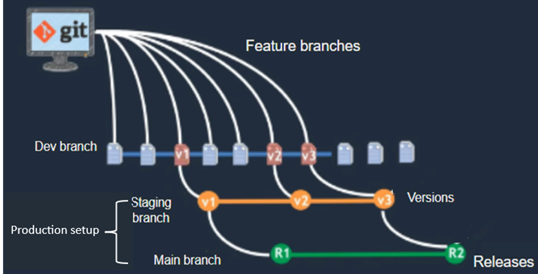
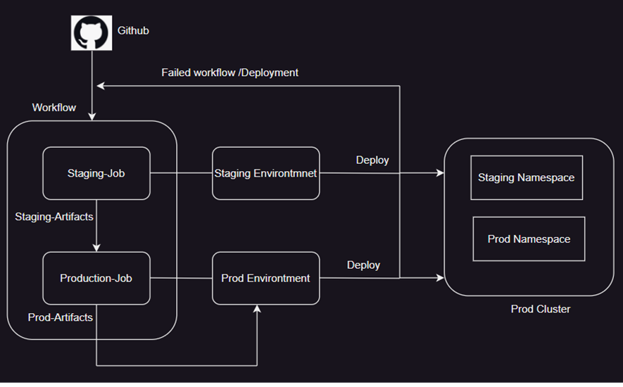
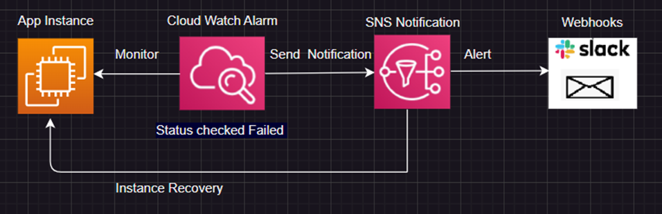

# Scenario 2 - production set-up
Discuss and justify below points: 

## 1. Recommendation as for the application environments (how many and why?) 

For the production setup, I recommend a minimum of two environments: the Production environment and the Staging environment. The Production environment is for the deployment of the final version of the application for end users, while the Staging environment is for testing purposes before deployment to Production; it will mirror the Production environment. However, from application development to deployment in Production, we need at least three environments, including the Development environment. In total, having at least three environments is ideal for a small application like a voting app to ensure that new features are developed, tested, and validated before being deployed to end users.

### 1.1	how are they going to be separated?

By the branching strategy and environment setup in GitHub. The automated CI/CD pipeline that can deploy the application to the corresponding environment based on the dedicated branch. 
#### Branching Strategy
To efficiently manage app deployment and ensure proper code promotion through various environments, the following branching strategy is recommended in the production setup:

#### Staging Branch
 **Purpose:** This branch closely mirrors the production environment. It is used for final testing before deployment to ensure everything works as expected in a production setting.
#### Main Branch
**Purpose:** This branch is used for production-ready code. Merging into this branch from the Staging branch initiates deployment to the Production environment.

The following diagram represent the branching strategies. 

The following diagram illustrate the environments and the application deployment model in production setup:
 
 **Note:** I have chosen to deploy the application on a Kubernetes cluster. If we opt not to use a cluster, we can have separate instances for each environment. However, within the cluster, I have isolated the two environments by namespace because it is more cost-effective to maintain a single cluster rather than separate clusters for each environment, and it also simplifies maintenance.

## 2. Which tooling will you use for CI/CD and why? 

I have selected GitHub Actions as the CI/CD tool for this app deployment. GitHub Actions was chosen because it provides secure secret management for pipelines, utilizes branch protections, and offers various pre-built actions. Additionally, GitHub Actions’ security can be enhanced by following GitHub’s best practices for CI/CD.

### 2.1 How to ensure no downtime during deployments? 
To ensure no downtime during deployments, I will implement one of the following strategies:
* Rolling Updates: 
 This deployment strategy updates application instances gradually. By replacing instances one at a time, it minimizes disruption and allows for quick rollback if issues arise.
* Blue/Green Deployment: this strategy involves running two environment, blue (current) and green (new). Traffic is gradually shifted from the blue to the green environment. However, it can incur additional costs for maintaining two environments simultaneously.
* Canary Deployment: this approach involves deploying changes to a small subset of users first before a full-scale release. This helps identify and fix issues early while minimizing the impact on all users.
**Recommendation:** 
I recommend using the canary deployment method for production setups over rolling updates and blue/green deployment to ensure zero downtime at minimal cost. Canary deployment allows us to gradually test the new version on a small subset of users. For instance, Route 53 can be configured using weighted policies to redirect a small amount of traffic to another instance. This approach reduces the risk of widespread issues, minimizes resource usage, and avoids the high costs associated with maintaining duplicate environments or handling complex rollbacks. It stands out as the most cost-effective approach for stable, zero-downtime releases.

## 3	What is the additional tooling you need to supplement the application with to ensure it runs smoothly on production? (e.g. from observability) 

### 1.	Prometheus and Grafana monitoring stack:
For robust monitoring, we can use Prometheus and Grafana together to monitor the application's health in real time and receive alerts in case of any failures. Prometheus can be set up to monitor metrics such as application uptime, while Grafana can be configured to track those metrics and send alerts to notification channels like webhooks, email, Slack, etc. Additionally, we can use AWS Managed Grafana and Prometheus to avoid the operational burden of managing infrastructure resources.
- To respond to alert notifications and roll back to a previous version, we can use:
  - Automated Rollback:
      Kubernetes: Leverage Kubernetes' built-in rollback capabilities to revert to a previous deployment.

### 2.	AWS Monitoring and Observability tools:
AWS offers a wide range of AI-powered observability tools. When we deploy an application in the AWS Cloud, we can leverage several built-in monitoring and observability services. For instance, AWS CloudWatch provides us with insights into the performance and operational health of our applications and infrastructure. To ensure smooth operation, we can set up CloudWatch metrics to monitor the application's health. If the application goes down, CloudWatch will trigger an alarm and send a notification via AWS SNS. Additionally, we can configure an AWS Lambda function to automatically roll back to the previous version if needed, ensuring minimal disruption and quicker recovery.

## 4. Networking & DNS-records management and networking protection rules 

### Networking:
* For the networking setup of application, we can use AWS Network ACLs: Control traffic by allowing or denying specific inbound or outbound traffic at the subnet level.  
* VPCs to define our own IP address range, subnets, route tables, and network gateways. This enables us to design a network that meets the specific needs of our application.
### DNS Records Management:
To manage the DNS records of application can use AWS Route 53 which can manage DNS queries and can block malicious DNS queries.
### Networking Protection Rules:
To define network protection rules for the application, we can use multiple tools such as AWS Network Firewall, AWS Web Application Firewall (WAF), NGINX Ingress Controller, and Istio. Each of these tools offers unique features and capabilities to enhance the network security of the application. However, I recommend using AWS Network Firewall, which is highly flexible and facilitates the creation of custom firewall rules to protect our unique workloads. The rules can be based on port, protocol, and domain. Currently, the voting application is exposed by a Kubernetes service and uses specific ports; therefore, IP and port security need to be ensured. This can be easily managed by defining network policies in AWS Network Firewall.

## 5. Mechanisms to ensure reliability and scalability 
### Reliability: 
To ensure reliability of the application, we can use Multi-Zone Deployment in the Kubernetes cluster across multiple availability zones or regions to ensure resilience against zone failures or regional failure.  In case of failure in one region or zone, the traffic is automatically redirected to another healthy zone or region.
### Scalability: 
For the scalability issues of the voting application, we can use a Load Balancer to distribute traffic across multiple instances, ensuring no single point of failure. Additionally, horizontal auto scaling is the best choice for your voting application. It allows to add or remove instances based on traffic load, ensuring scalability with cost efficiency. In Kubernetes, the Horizontal Pod Autoscaler (HPA) can automatically adjust the number of pods based on metrics like CPU usage or request count, maintaining performance and availability during peak times.

## 6. Alerting considerations
When the application goes down, it's essential for us to have an alerting system that not only notifies us of the issue but also automates the remediation process. There are several options for managing alerts.
### Prometheus Alertmanager: 
we can use this Alertmanager to handle alerts, set up alerting rules in Prometheus to detect failures, and ensure Prometheus can communicate with Alertmanager. Once set up, test the configuration by simulating an application failure. This will help us verify that alerts are being sent correctly to the designated channels, such as webhooks, email, Slack, or other notification platforms. By doing so, we can ensure that the alerting system works as expected and provides timely notifications in case of issues.
###  AWS:  
In AWS infrastructure setup, we can use CloudWatch Alarms to monitor various metrics. For example, if an application fails, CloudWatch can send notifications based on predefined metrics. We can configure CloudWatch alarms to trigger and send notifications via SNS (Simple Notification Service). Additionally, we can create a Lambda function that responds to these SNS notifications to automatically remediate the failure, such as restarting services or replacing failed instances or rollbacks etc. The following picture describe how a simple alert system can configure in AWS infrastructure. 
 

  

